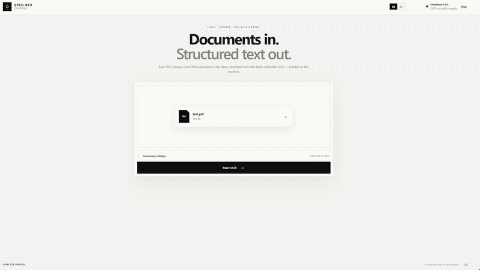
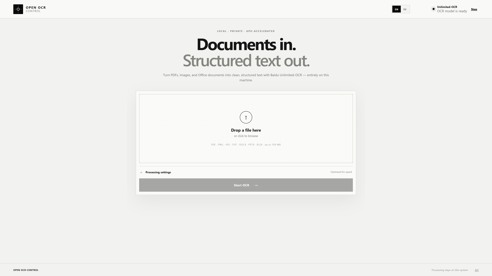
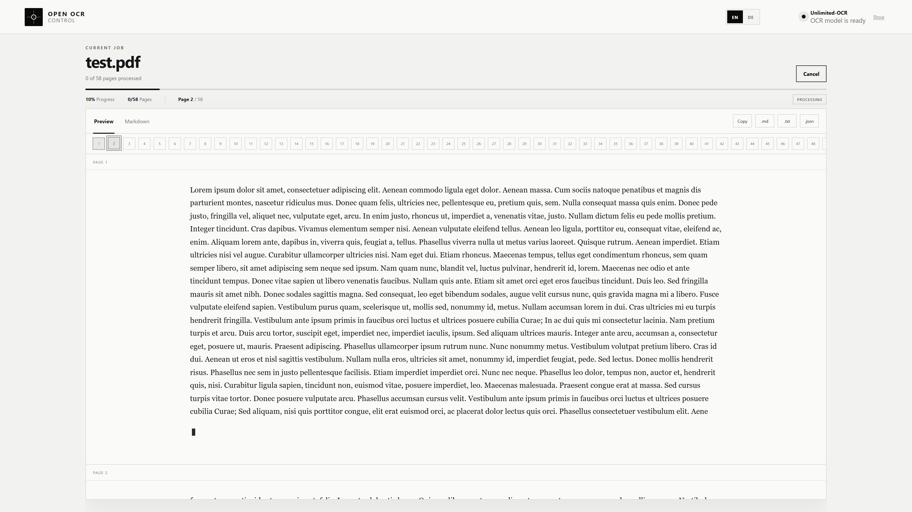
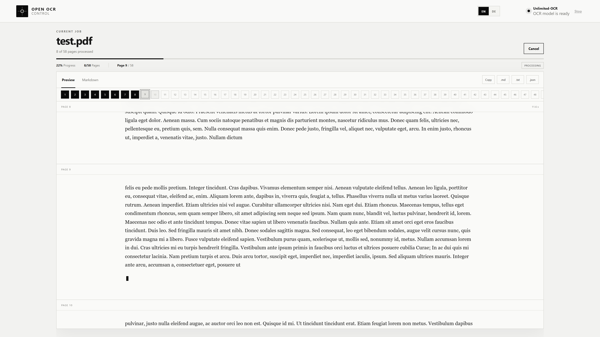

# Open OCR Control

**English** | [Deutsch](docs/README.de.md)

Local, GPU-accelerated document recognition powered by
[Baidu Unlimited-OCR](https://huggingface.co/baidu/Unlimited-OCR). Upload PDFs, images, or common
Office documents, follow recognition live in the browser, and export raw Markdown or a complete,
portable ZIP including detected document images.



The web application binds to all host interfaces on **port 3011** by default, so other devices on
the trusted local network can use it. The vLLM/Unlimited-OCR service stays local and internal on
**port 3111**. Both components are containerized, and documents and model output stay on the host.

## Features

- English interface by default, with a persistent German language switch
- Drag and drop for PDF, PNG, JPEG, WebP, BMP, TIFF, DOC(X), ODT, RTF, PPT(X), XLS(X), and ODS
- Live, page-level streaming through Server-Sent Events
- Automatic restoration of running and completed jobs after a browser reload
- Parallel, ordered page processing with adjustable speed and quality
- A sanitized rich preview for Markdown, HTML tables, GFM tables, and LaTeX formulas
- Local previews of figure regions marked by the model, with those images included in complete ZIPs
- A sequential batch mode with additive file selection/drop, per-document tabs, and one combined ZIP
- A viewport-filling workspace with an automatically following current-page indicator
- Copying plus raw `.md`, complete `.zip`, `.txt`, and structured `.json` exports
- On-demand start and stop control for the dedicated Unlimited-OCR container
- Responsive, accessible grayscale interface with a single browser-viewport layout
- Upload, page, time, render, and concurrency limits to prevent misconfiguration
- OCI image releases through GitHub, including SBOM and build provenance

## Interface

### Upload workspace



### Live page-by-page recognition

<p>
  
  
</p>

## Requirements

- Docker Desktop or Docker Engine with Compose
- An NVIDIA GPU with at least 8 GB of VRAM
- A current NVIDIA driver and a working NVIDIA Container Toolkit
- Approximately 20 GB of free space for the runtime image, model, and cache

The default image, `vllm/vllm-openai:unlimited-ocr`, uses CUDA 13.0. For Hopper GPUs using CUDA
12.9, Baidu also documents `vllm/vllm-openai:unlimited-ocr-cu129`; select it through
`OCR_DOCKER_IMAGE` on the app container or change the image in the Compose profile.

## Quick start

Pull the upstream model image and start the application:

```bash
docker pull vllm/vllm-openai:unlimited-ocr
docker compose up -d --build app
```

Open [http://localhost:3011](http://localhost:3011) on the Docker host or
`http://<HOST-LAN-IP>:3011` from another computer on the same trusted network. On the first OCR job,
the app creates the
`unlimited-ocr` container, exposes it through port 3111, and waits for vLLM to become ready. The
initial start can take several minutes while the model is downloaded. Xet high-performance mode is
enabled by default. A personal Hugging Face token can raise Hub rate limits:

```bash
HF_TOKEN=hf_... docker compose up -d
```

To load the model as soon as Compose starts:

```bash
docker compose --profile eager up -d --build
```

Inspect status and logs:

```bash
docker compose ps
docker compose logs -f app
docker logs -f unlimited-ocr
```

Stop the stack. Cached model data and retained job files remain available, while app-managed model
containers are removed cleanly:

```bash
docker compose down
```

### Published app image

Every published GitHub Release builds a `linux/amd64` application image:

```bash
docker pull ghcr.io/timbornemann/open-ocr-control:latest
```

Set `app.image` in `docker-compose.yml` to this image and remove the `build` block if desired. The
GPU model intentionally remains a separate upstream image.

## Processing pipeline

1. The app stores the upload in an isolated job directory.
2. LibreOffice converts Office documents to PDF in headless mode.
3. PDFs render page by page as high-quality JPEG images at 200 DPI by default.
4. Two pages are sent to `/v1/chat/completions` in parallel by default.
5. Model output streams live. Image detections are mapped from the model's normalized coordinates
   to local crops of the rendered page; other grounding coordinates are removed.
6. The raw Markdown is retained separately. The rich preview sanitizes embedded HTML, renders
   tables and local images, and typesets supported formulas with KaTeX.
7. Batch documents are queued and processed one after another; configured page concurrency still
   applies inside the active document.
8. The browser stores only the active job/batch ID and restores its server snapshot and live stream
   after a page reload. Results remain available until the app process restarts; work directories
   older than 24 hours are removed on the next app start.

The page-level strategy is more robust for long PDFs than one multi-page request: each page gets
its own token budget, progress becomes visible immediately, and one failed page does not invalidate
the complete document. Higher concurrency improves throughput but uses more VRAM.

## Rich preview and security

Unlimited-OCR can return GFM Markdown, raw HTML tables, and several math delimiter styles. The
preview supports `$…$`, `$$…$$`, `\(…\)`, `\[…\]`, and OCR-style mathematical parentheses when
their content has clear math syntax. Raw HTML is parsed into an AST and sanitized before React or
KaTeX receives it; scripts, event handlers, model-provided styles, and external images are removed.
Extracted figures are served only from the same job-scoped API. Raw Markdown stays model-oriented,
while the complete ZIP rewrites those figure links to portable `assets/` paths.

This decision is documented in
[ADR 0005: Secure rich preview](docs/adrs/0005-secure-rich-preview.md).

## Configuration

All application variables start with `OCR_`. The most relevant values are:

| Variable | Default | Purpose |
|---|---:|---|
| `APP_BIND` | `0.0.0.0` | Host interface used by Docker Compose for port 3011 |
| `OCR_BASE_URL` | `http://localhost:3111/v1` | OpenAI-compatible vLLM API |
| `OCR_MANAGE_CONTAINER` | `true` | Permit start/stop control through the Docker Engine |
| `OCR_DOCKER_IMAGE` | `vllm/vllm-openai:unlimited-ocr` | Model container image |
| `OCR_GPU_MEMORY_UTILIZATION` | `0.85` | Fraction of GPU memory reserved by vLLM |
| `OCR_HF_TOKEN` | empty | Optional Hugging Face token for higher rate limits |
| `OCR_HF_XET_HIGH_PERFORMANCE` | `true` | Maximize parallel model downloads |
| `OCR_MAX_UPLOAD_MB` | `100` | Maximum upload size |
| `OCR_MAX_BATCH_FILES` | `25` | Maximum documents in one batch |
| `OCR_MAX_BATCH_UPLOAD_MB` | `500` | Maximum combined batch upload size |
| `OCR_MAX_PAGES` | `200` | Maximum pages per job |
| `OCR_MAX_RENDER_MEGAPIXELS` | `50` | Decompression/render limit per page |
| `OCR_DEFAULT_DPI` | `200` | Default rendering quality (150–300) |
| `OCR_DEFAULT_PAGE_CONCURRENCY` | `2` | Parallel OCR pages |
| `OCR_DEFAULT_MAX_TOKENS` | `8192` | Output token budget per page |
| `OCR_JOB_RETENTION_HOURS` | `24` | Retention of temporary job files |

See [.env.example](.env.example) for the complete template. Compose sets
`OCR_BASE_URL=http://unlimited-ocr:8000/v1` internally and uses the fixed `open-ocr-control`
network.

### Local network access

Only TCP port 3011 needs to be reachable from client computers. Do not expose or forward port 3111;
the app reaches Unlimited-OCR through the internal Docker network. If the host firewall blocks
connections, mark the trusted LAN as a private network and allow inbound TCP 3011 for that profile
only. Do not add router port
forwarding because the application has no user authentication.

To return to host-only access, set `APP_BIND=127.0.0.1` in `.env` and recreate the app container.

### Operating without the Docker socket

The Docker socket grants extensive host privileges to the app container. For stronger isolation,
start the model yourself, remove the socket mount, set `OCR_MANAGE_CONTAINER=false`, and use a URL
such as `http://host.docker.internal:3111/v1`. The UI can then check the model but cannot start or
stop it. See the [operations guide](docs/operations.md#docker-socket-und-berechtigungen) for details.

On Linux, the Docker socket group ID may be required:

```bash
DOCKER_GID=$(stat -c '%g' /var/run/docker.sock) docker compose up -d --build
```

## Development

The backend uses Python 3.11–3.13, FastAPI, PyMuPDF, Pillow, and the Docker SDK. The frontend uses
React, TypeScript, Vite, and a sanitized unified/KaTeX rendering pipeline.

```bash
python -m venv .venv
# Linux/macOS: source .venv/bin/activate
# Windows: .venv\Scripts\activate
python -m pip install -e ".[dev]"

cd frontend
npm ci
npm run build
cd ..

pytest
ruff check app tests
mypy app
python -m app
```

For frontend hot reload, `npm run dev` listens on port 5173 and proxies `/api` to port 3011.
Quality rules live in [CONTRIBUTING.md](CONTRIBUTING.md); architecture and decisions are documented
in [docs/architecture.md](docs/architecture.md) and [docs/adrs](docs/adrs). Hardware and end-to-end
verification results are recorded in [docs/verification.md](docs/verification.md).

## API

OpenAPI/Swagger: [http://localhost:3011/api/docs](http://localhost:3011/api/docs)

| Method | Path | Purpose |
|---|---|---|
| `GET` | `/api/health` | Application liveness |
| `GET` | `/api/ocr/status` | Model/container status |
| `POST` | `/api/ocr/start` | Start the model container |
| `POST` | `/api/ocr/stop` | Stop the model container |
| `POST` | `/api/jobs` | Accept a multipart document upload |
| `GET` | `/api/jobs/{id}` | Return job state and results |
| `GET` | `/api/jobs/{id}/events` | Stream live SSE updates |
| `DELETE` | `/api/jobs/{id}` | Cancel a job |
| `GET` | `/api/jobs/{id}/assets/{name}` | Return one extracted image asset |
| `GET` | `/api/jobs/{id}/export?format=markdown` | Export raw Markdown, text, JSON, or a complete ZIP |
| `POST` | `/api/batches` | Accept multiple multipart uploads |
| `GET` | `/api/batches/{id}` | Return batch and per-document state |
| `GET` | `/api/batches/{id}/events` | Stream aggregate batch/job SSE updates |
| `DELETE` | `/api/batches/{id}` | Cancel the batch and remaining documents |
| `GET` | `/api/batches/{id}/export` | Export all results as a directory-structured ZIP |

## Limitations

- OCR output can contain recognition errors and must be reviewed for critical data.
- Jobs intentionally live in one process. Browser reloads are restored, but an app-container
  restart, multiple replicas, or durable recovery requires an external job store.
- Very complex pages can require more than 8,192 output tokens; the limit is adjustable in the UI.
- Only regions explicitly labelled `image` by Unlimited-OCR are extracted. A missed or inaccurate
  grounding box can therefore omit a figure or produce an imperfect crop.
- Raw `.md` intentionally contains no binary files; use the complete ZIP for portable Markdown and
  its referenced images.
- Password-protected PDFs are rejected.
- The app is designed for trusted local networks and does not include user authentication.

## Upstream compatibility

The integration follows the official
[vLLM recipe for Unlimited-OCR](https://recipes.vllm.ai/baidu/Unlimited-OCR): a literal `<image>`
prompt, `skip_special_tokens=false`, the N-gram processor with size 35/window 128, and disabled
prefix/MM-processor caches. The
[Baidu model card](https://huggingface.co/baidu/Unlimited-OCR) documents Markdown output, the
32,768-token context, official Docker images, and the visualization format used for detected image
regions. The crop/link behavior follows Baidu's official `save_results` implementation.

## License

GPL-3.0-or-later; see [LICENSE](LICENSE) and [NOTICE](NOTICE). Baidu Unlimited-OCR and vLLM are
separate upstream projects with their own licenses. Their images and model weights are not
redistributed by this repository.
