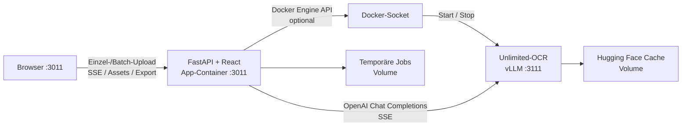
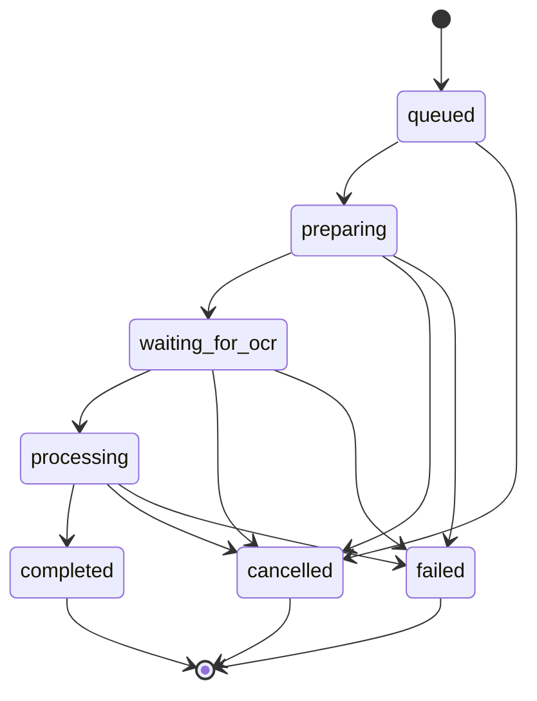

# Architektur

## Kontext

Open OCR Control ist ein lokales Control Plane vor einem separaten, GPU-beschleunigten
Unlimited-OCR/vLLM-Container. Das App-Image enthält HTTP-API, Job-Orchestrierung,
Dokumentkonvertierung und die gebaute React-Oberfläche. Modellgewichte bleiben im benannten
Hugging-Face-Volume.

## Komponenten

| Komponente | Verantwortung |
|---|---|
| `app/api.py` | stabile HTTP-, SSE- und Exportgrenze |
| `JobManager` | Job-/Batch-Lebenszyklus, sequenzielle Dokumentqueue, Seitenparallelität, Abbruch und Events |
| `DocumentProcessor` | Validierung, Office→PDF, PDF/Bild→JPEG-Seiten |
| `OcrClient` | vorgeschriebener vLLM-Payload und verlustfreies SSE-Parsing |
| `OcrOutputProcessor` | Grounding-Auswertung, Bildausschnitte sowie Roh-/Rich-Markdown |
| `DockerManager` | genau einen fest konfigurierten Modellcontainer starten/stoppen |
| React-App | Einzel-/Mehrfachupload, Dokument-Tabs, Live-Vorschau, Kopieren und Export |

## Auftragszustände

Jede Seite besitzt zusätzlich `pending`, `processing`, `completed`, `failed` oder `cancelled`.
Seitenfehler werden isoliert; der Auftrag ist erfolgreich, sobald mindestens eine Seite erkannt
wurde. Exporte behalten die Seitenreihenfolge unabhängig von paralleler Fertigstellung bei.

## Live-Protokoll

`GET /api/jobs/{id}/events` verwendet benannte SSE-Events mit monotoner ID. EventSource sendet bei
Reconnect `Last-Event-ID`; der Server liefert die begrenzte In-Memory-Historie nach. Delta-Events
werden in Blöcken gesammelt, um Browser- und Speicherlast zu reduzieren. Alle 15 Sekunden hält ein
Kommentar die Verbindung offen.

`GET /api/batches/{id}/events` ergänzt Batchfortschritt und kapselt Jobevents mit ihrer Job-ID. Ein
Batch verarbeitet immer nur ein Dokument gleichzeitig. Die Seitenparallelität innerhalb dieses
Dokuments bleibt davon unberührt.

Die API-Snapshots liefern zusätzlich die letzte Event-ID. Der Browser speichert Job-/Batch-ID und
ausgewählten Dokument-Tab in `localStorage`, lädt nach einem Seiten-Neuladen zuerst den aktuellen
Snapshot und öffnet den SSE-Stream anschließend mit `after_event_id`. Dadurch gehen Events zwischen
Snapshot und Reconnect nicht verloren und bereits geladene Textdeltas werden nicht verdoppelt.

## Performance

- PDF-Rendering und Office-Konvertierung blockieren nicht den Event Loop.
- JPEG bei 200 DPI reduziert Uploadgröße zur lokalen vLLM-API gegenüber 300-DPI-PNG deutlich.
- Standardparallelität 2 nutzt GPU-Batching, ohne kleine GPUs direkt zu überlasten.
- Sequenzielle Dokument-Batches begrenzen Spitzen bei Render-RAM, VRAM und Ausgabedateien.
- Jede Seite erhält 8192 Tokens; Nutzer können Qualität, Parallelität und Budget anpassen.
- Prefix- und MM-Processor-Caches sind gemäß Upstream-Rezept deaktiviert.

## Persistenz

Auftrags-, Batchmetadaten und Event-Historien liegen absichtlich im Arbeitsspeicher. Quelldatei,
gerenderte Seiten, extrahierte Bildbereiche und erzeugte ZIPs liegen im Volume und werden nach
Ablauf der Retention beim App-Start entfernt. Diese Ausführung ist auf einen App-Prozess beschränkt.
Eine spätere horizontale Skalierung benötigt einen externen Queue-/State-Store und Object Storage.
Die Browser-Sitzungsreferenz ist keine zusätzliche Ergebnispersistenz und wird bei unbekannter
Server-ID verworfen.
